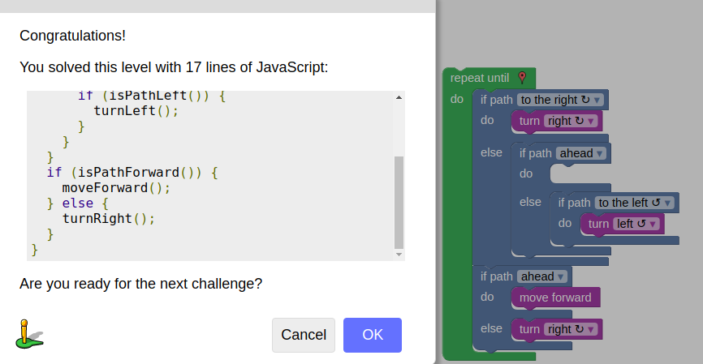

# Lab 1

## Readings

### Open Source Definition

The 10 criteria of open source are as follows:

1. Free Redistribution
2. Source Code
3. Derived Works
4. Integritty of The Author's Source Code
5. No Discrimination Against Perons or Group
6. No Discrimination Against Fields of Endeavor
7. Distribution of License
8. License Must Not Be Specific to a Product
9. License Must Not Restrict Other Software
10. License Must Be Technology-Neutral

These criteria are necessary for free, open, and fair software development and usage.

### Smart Questions

In Eric Raymond's article *Smart Questions* the author addresses how to properly find a source to answer your question and how to phrase your question properly so that it may be answered promptly.

Upon further analysis, I found that there are a few additional methods for efficiently answering your own questions.

1. Often times, when you pose a question you already have a partial or complete answer which you would like to either verify or expand upon. In these cases, it is import to explain your thought process and background throughly so that any potential answerers can provide an appropriate response.
2. Opposite of the first case, when you have absolutely no clue how to address a problem it is often times not the best solution to simply pose the question "I have no idea how to do this. How do you do it?". This doesn't allow a potential responder to understand the source of your confusion. It would be better to explain your thought process throughly and pinpoint your specific area of confusion so that your answer can be properly addressed.

### Free Culture

Chapter 3 of *Free Culture* describes a student at RPI, Jesse Jordan, who developed his own search engine in his free time. However, this seemingly innocent project devolved into serious legal accusations when the Recording Industry Association of America (RIAA) decided to sue Jesse. The lawsuit file by the RIAA asserted that Jesse's search engine was facilitating music piracy and that Jesse was required to pay $12,000 for the lawsuit to be dismissed. This forced Jesse's hand and rather than going to court and paying more than $12,000, Jessie decided to settle. This story is a great example of why the open source movement is a positive trend because it allows people to write and modify code without fear of legal trouble. In Jesse's case, the RIAA was acting like a proprietary software distrubutor whose sole good is profit. Entities like the RIAA, while necessary in some regard, can easily overstep their bounds and stifle technology advancement. By shifting more and more software projects to the open source scene, we are not only decreasing the fear of legal trouble for software developers but facilitating the advanced of technology by encouraging an exchanging of ideas.

## Linux

Tree documentation:

Tree Example Output:

## Regex

### RegexOne

### Regex Crosswords

### Blockly Maze Challenge

### Reflection

As a computer system engineering / computer science student, the [RISC V](https://riscv.org/) instruction set architecture (ISA) caught my eye. RISC V is a free and open ISA, as apposed to x86 and ARM which require a license to use, and is picking up steam in academics and industry. There are a host of open source projects related to RISC V which can be found [here](https://riscv.org/software-status/). I'm specifically interested in one of the RISC V simulators called [RARS](https://github.com/TheThirdOne/rars) and think it would be an interesting project to evaluate.

**Lab Completion Process**  
I did this lab by forking the [oss-repo-template](https://github.com/rcos/oss-repo-template) and then cloning the fork to my local machine. From there, I completed the assignments and typed up lab01.md using the [ReText](https://github.com/retext-project/retext) editor. Once completed, I pushed my local repo to my forked repo on github.