# Lab 1

## Readings

### Open Source Definition

The 10 criteria of open source are as follows:

1. Free Redistribution
2. Source Code
3. Derived Works
4. Integritty of The Author's Source Code
5. No Discrimination Against Perons or Group
6. No Discrimination Against Fields of Endeavor
7. Distribution of License
8. License Must Not Be Specific to a Product
9. License Must Not Restrict Other Software
10. License Must Be Technology-Neutral

These criteria are necessary for free, open, and fair software development and usage.

### Smart Questions

### Free Culture

### Beautiful Code

## Linux

Tree documentation:

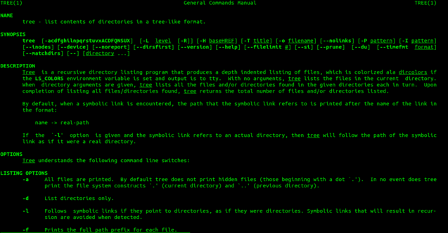

Tree Example Output:

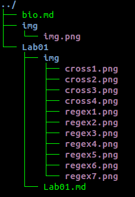

## Regex

### RegexOne

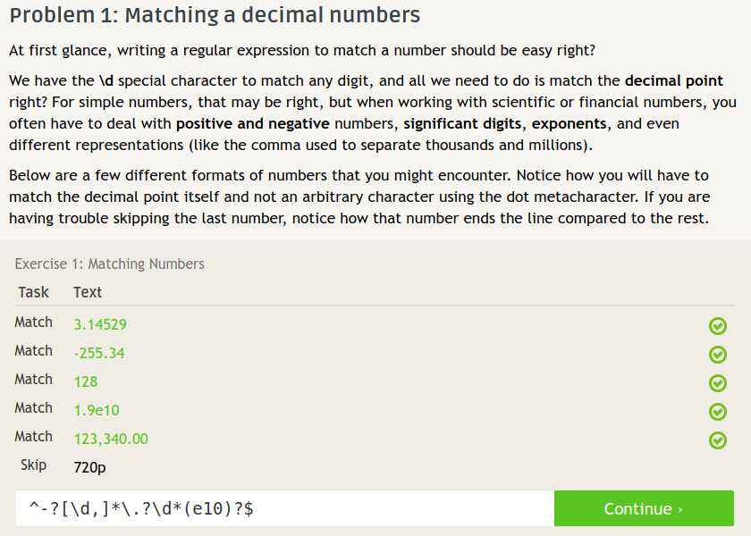

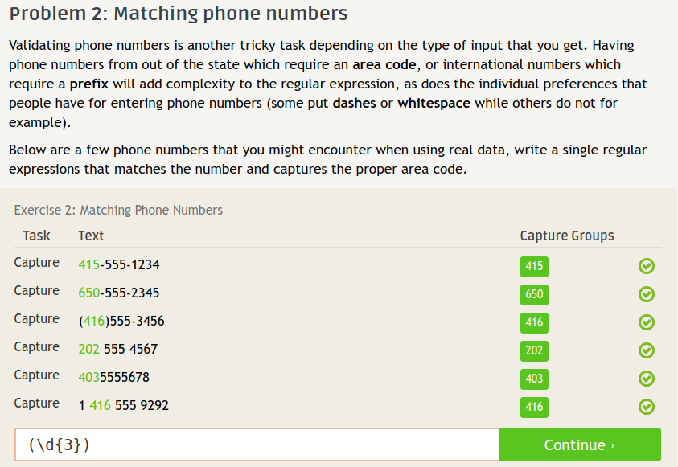

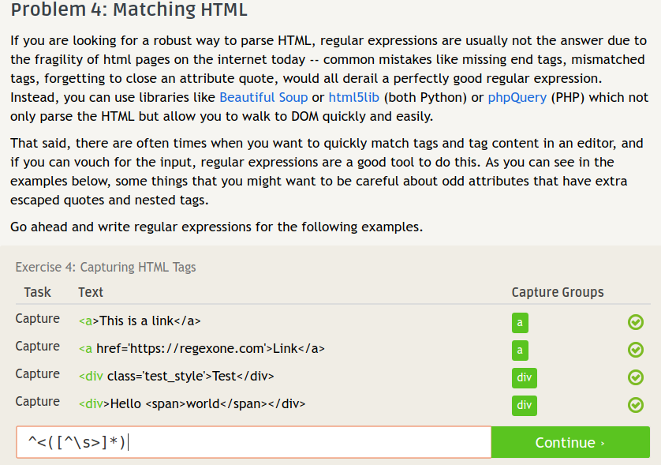

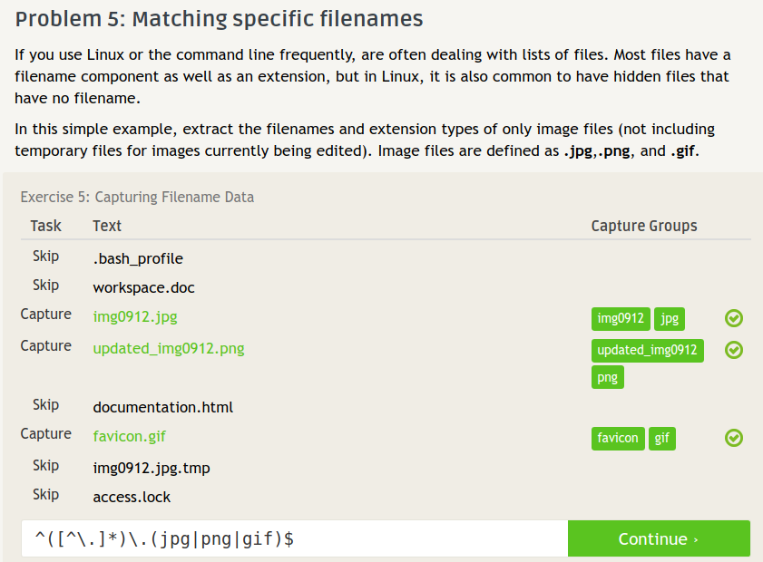

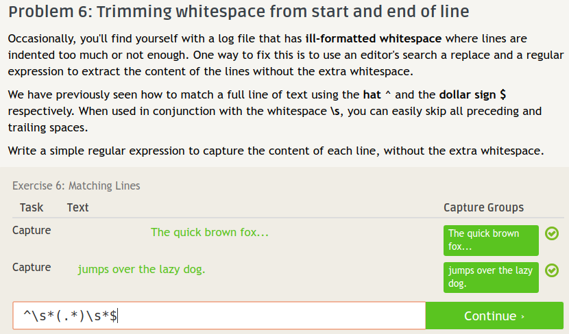

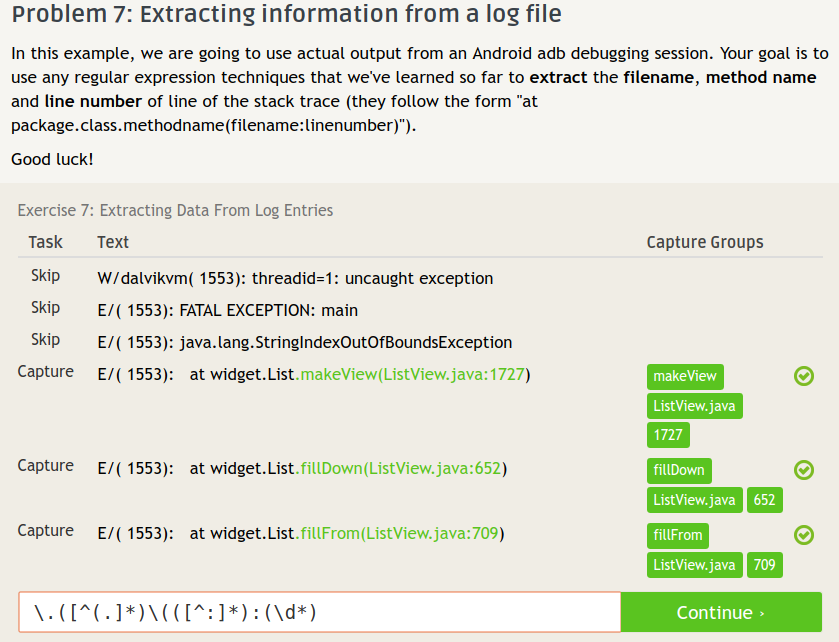

### Regex Crosswords

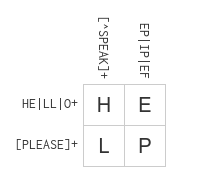

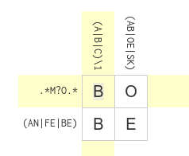

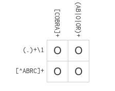

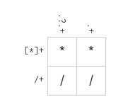
