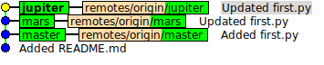
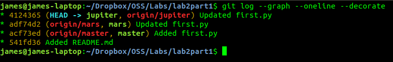
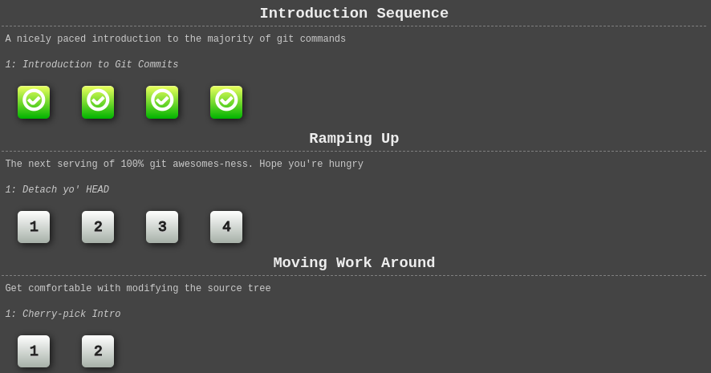
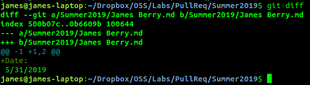

# Lab 2

## Part 1

[lab2part1 repo](https://github.com/berryj6/lab2part1)

### Repo structure
**gitk:**

**git log:**

## Part 2

**Forked Repository:** [forked repo](https://github.com/berryj6/Spoon-Knife)

**Learn Git Branching:**

**Pull Request:** [pull req](https://github.com/berryj6/PullReq)

**Git Diff:**

After modifying 'James Berry.md' git diff displays the following:

**References Repo:** [references](https://github.com/berryj6/courseProject)

**Shared Project Ideas Repo:** [shared repo](https://github.com/beshaz/OSSProjectIdeas)