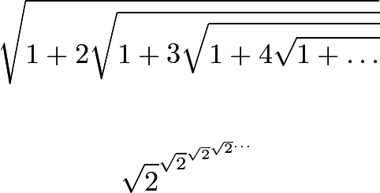
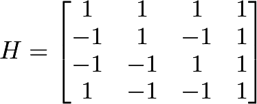
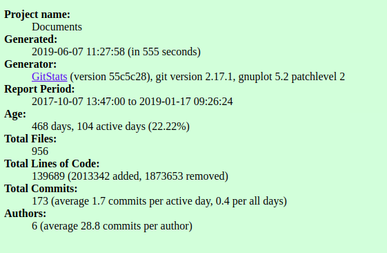
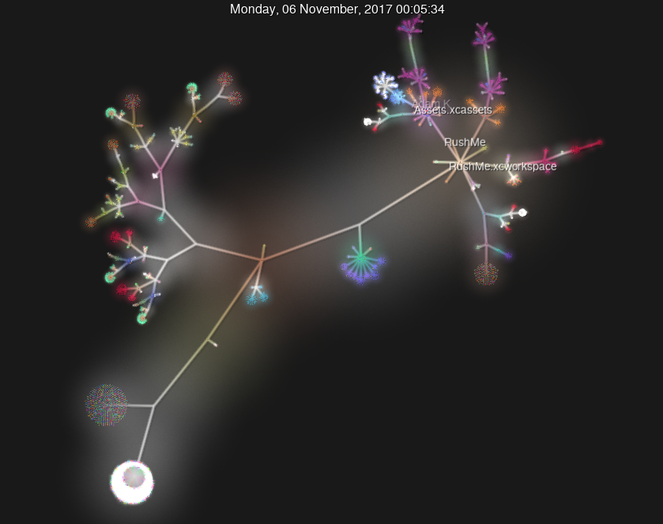
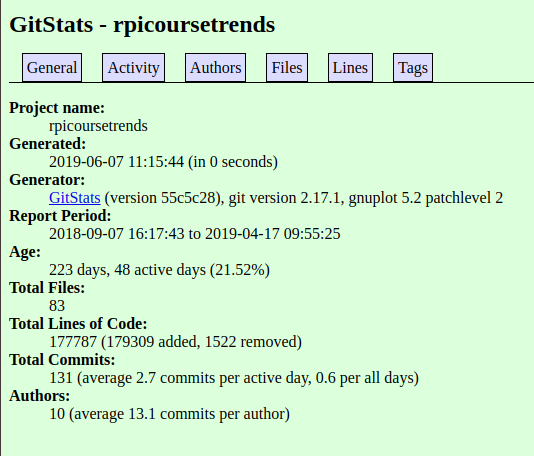
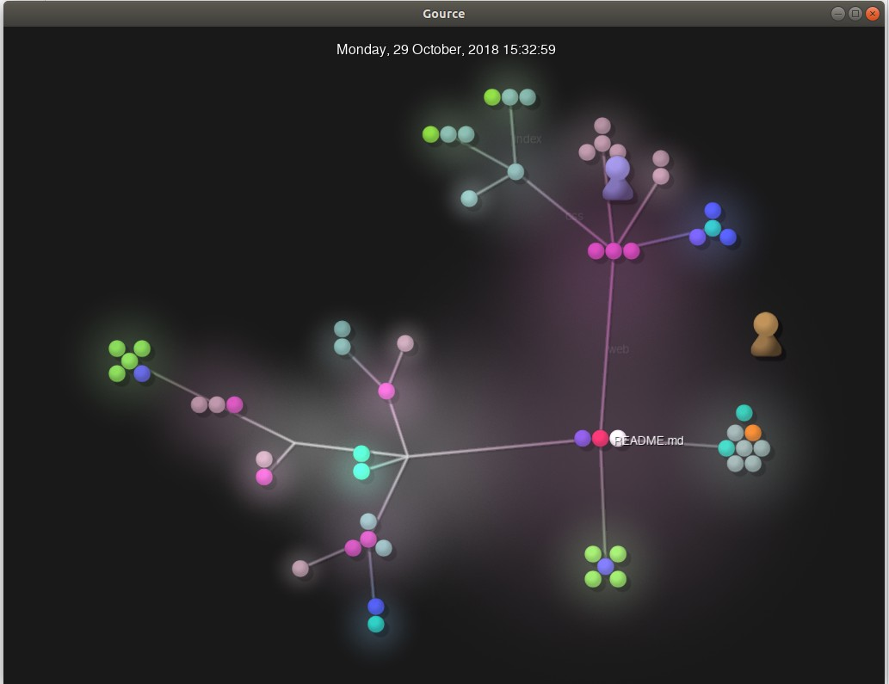
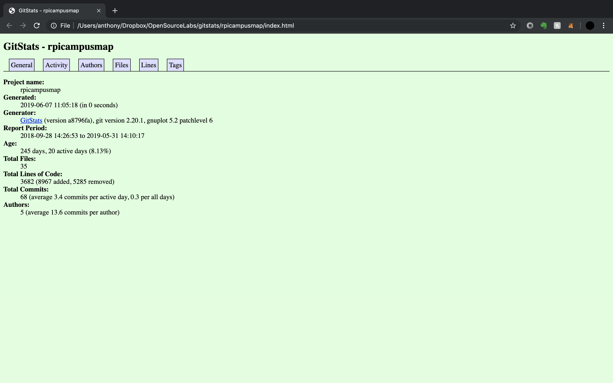
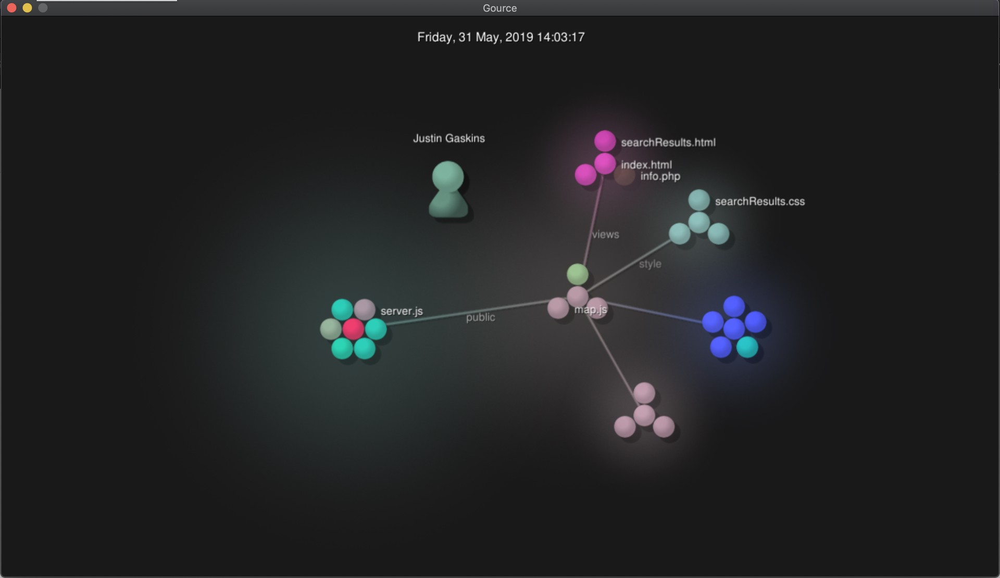
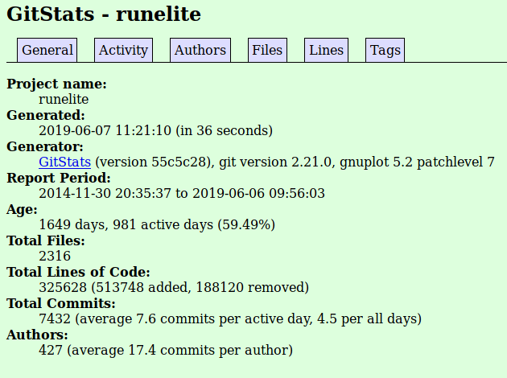
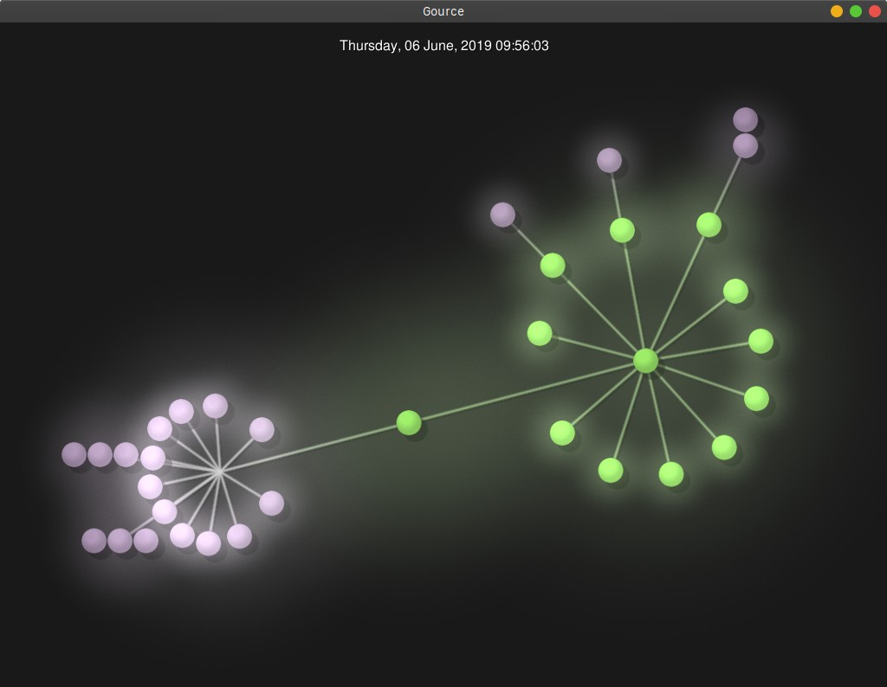

# Lab 3

## Part 1
**Wiki:** [wiki](https://github.com/berryj6/oss-repo-template/wiki/Project-Interests)

**Latex source:**

```
$$
\sqrt{1 + 2\sqrt{1 + 3\sqrt{1 + 4\sqrt{1 + \dots}}}}
$$

$$
\sqrt{2}^{\sqrt{2}^{\sqrt{2}^{\sqrt{2}^{\dots}}}}
$$
```

**Latex result:**



**Hadamard matrix source:**

```
$$
H = 
\begin{bmatrix}
1 & 1 & 1 & 1 \\
-1 & 1 & -1 & 1 \\
-1 & -1 & 1 & 1 \\
1 & -1 & -1 & 1
\end{bmatrix}
$$
```

**Hadamard matrix result:**



## Part 2

### RushMeiOS

Contributors: 3

Lines of code: 549,515

First commit: Sat Oct 7 13:47:00 2017

Last commit: Thu Jan 17 09:26:24 2019

Branches: 11

- Cam
- Chat
- ErrorSystem
- NewLook
- Notifications
- SaveFrats
- calendar
- changes-jim
- favorites
- linted-version
- master

**Gitstats:**



**Gource:**



### RPI Campus Trends Repo Data:

Number of Contributors: 5

Lines of Code: 181,974

First Commit: 9/2/18

Last Commit: 4/17/19

Current Branches: 2

- master
- flask-refractor

**Gitstat:**



**Gource:**



### RPI Campus Map

Number of contributors: 1

Number of lines of code: 18198

First commit: Sep 28, 2018

Latest commit: Mar 26, 2019 

Current branches: 5

- master
- forgemill-dev
- forgemill
- dev
- production

**Gitstat:**



**Gource:**



### Runelite

Number of contributers: 334
Number of lines of code: 48074
First commit: 6/6/2019 9:56 PM
Latest commit: 11/30/2014 8:35 PM
Current branches: 

- master

**Gitstat:**



**Gource:**


