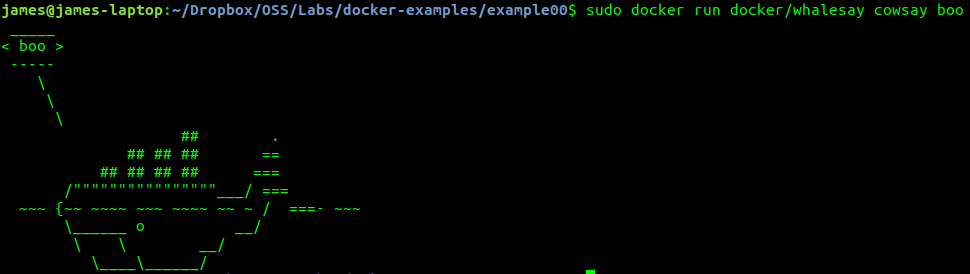
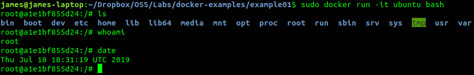
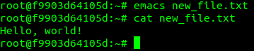
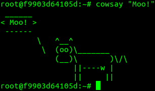
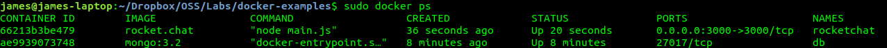
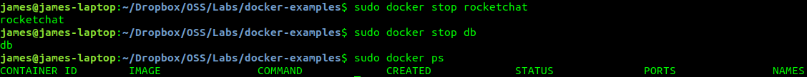
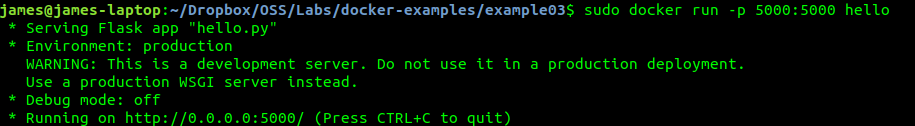
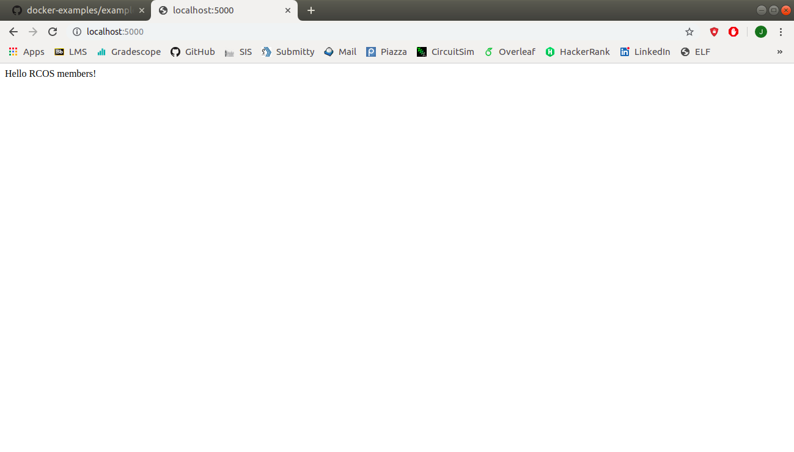
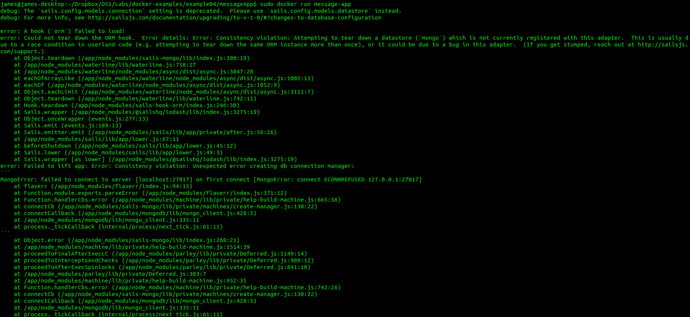
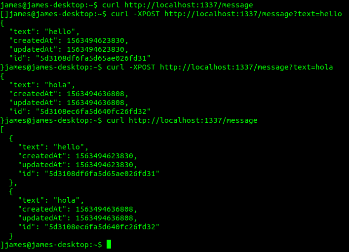

# Lab 6

## Example 0

Example 0 involved installing docker and running a test script as seen below:

## Example 1

First, we attached to bash shell in an ubuntu image with docker. This allows us to use an shell that is isolated from our main operating system.

From within the shell, we can install packages using `apt`. Emacs was installed and used to add a file to the `/root` directory.

Many other commands can be installed and used within the docker shell. For example, the command `cowsay` can be used as seen below.

## Example 2

In exercise 2 RocketChat was run inside of docker. First, a docker instance of mongo is started and then RocketChat can be run. Using the `docker ps` command, we can confirm these instances are running.

The docker instances can then be stopped using `docker stop`.

## Example 3

Docker allows for the creation of custom dockerfiles which you to run your own applications within docker. These dockerfiles can be built by running `docker build -t <container-name> .` in a directory with a file called `Dockerfile`. The container can then be run and, in this case, the results can be seen in a web browser.

## Example 4

In the final example we will use a yml file to manage multiple containers for use with a sinlge application. First, we will build a node.js container using `docker build -t message-app .`. However, when this container is run using the command below, an error occurs.

This error results because both the mongo and node.js containers have to be running at the same time. This can be resolved by using the `docker-compose` command which allows us to provide a configuration for an application and launch multiple containers. Then, once the application is running we can interface with it as seen below.

