# Lab 8

## Data Visualization with ggplot2

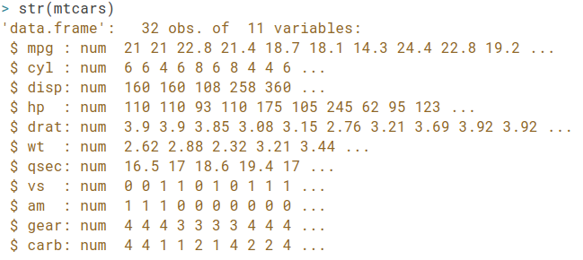

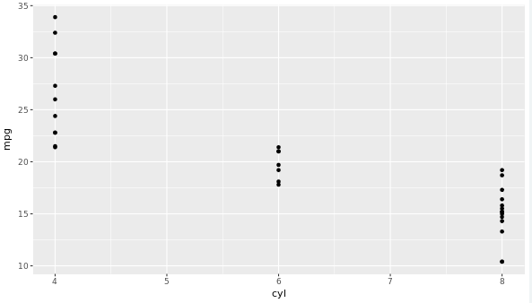

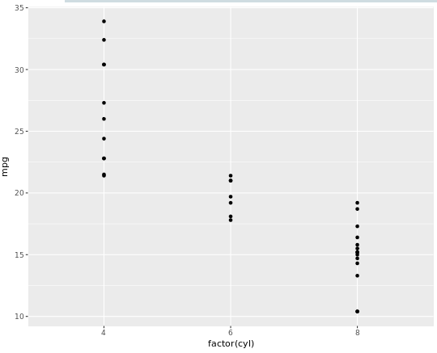

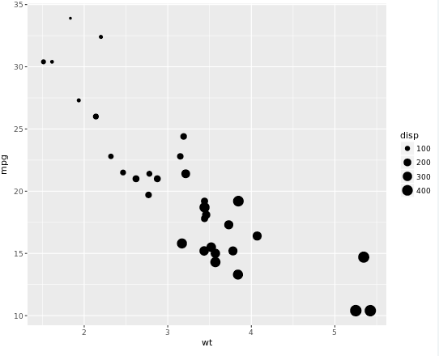

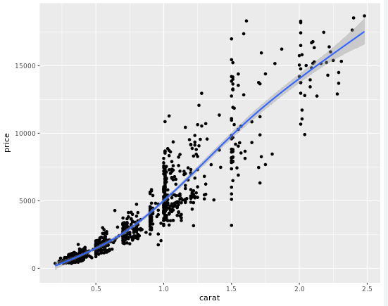

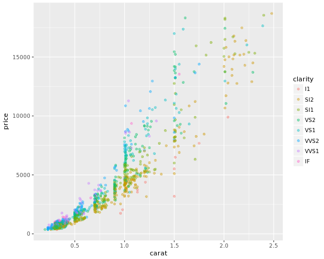

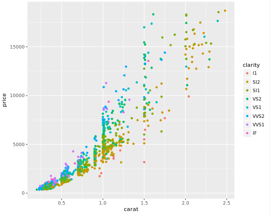

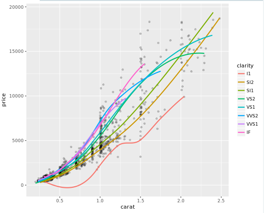

## Multiple and Logistic Regression

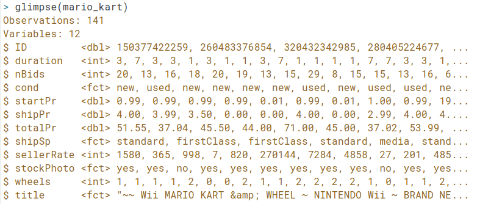

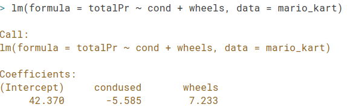

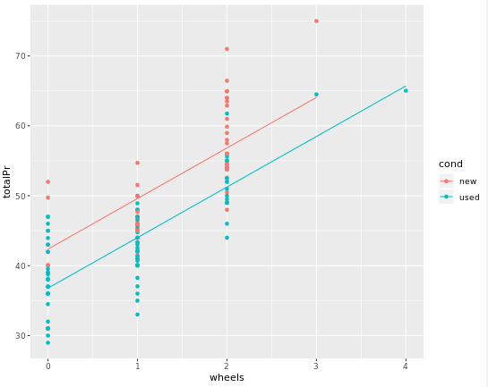

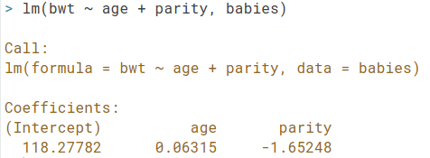

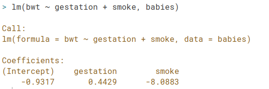

## Project

[Observatory page](https://rcos.io/projects/jgbcode/ruarc/profile)

[Communication channel](https://chat.rcos.io/rcos/channels/ruarc)