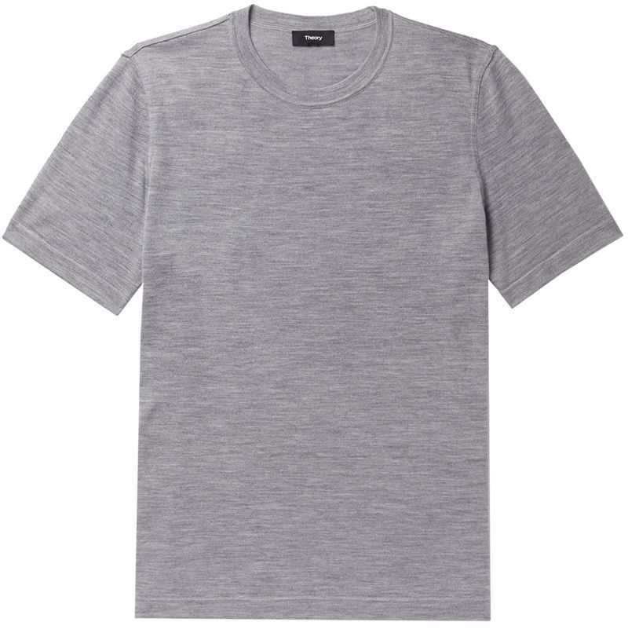
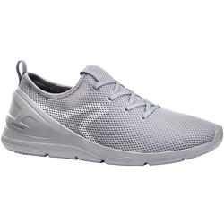

# Lab 9

## Checkpoint 1


## Checkpoint 2

**Modified code:**
```
# Plot the first X test images, their predicted label, and the true label
# Color correct predictions in blue, incorrect predictions in red
num_rows = 5
num_cols = 3
num_images = num_rows*num_cols
plt.figure(figsize=(2*2*num_cols, 2*num_rows))
for i in range(num_images):
  plt.subplot(num_rows, 2*num_cols, 2*i+1)
  plot_image(i + 9000, predictions, test_labels, test_images)
  plt.subplot(num_rows, 2*num_cols, 2*i+2)
  plot_value_array(i + 9000, predictions, test_labels)
plt.show()
```

**Results:**


## Checkpoint 3

**Shirt:**




**Pants:**


**Shoe:**




**Classification results:**


By observing the dataset, it can be noted that the shoes tend to be facing left in all sample images. Rerunning the classification with a flipped shoe image yields more accurate results.


